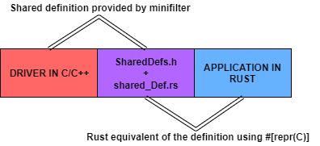

# minifilter-rs

**Use `cargo doc --no-deps --document-private-items --open` to read Documentation**

## Table of Contents

<details>
    <summary>Table of Contents</summary>

- [Minifilter Driver](https://github.com/SubconsciousCompute/fsfilter-rs#minifilter-driver)
    - [Building Driver](https://github.com/SubconsciousCompute/fsfilter-rs#building-driver)
    - [Installing Driver](https://github.com/SubconsciousCompute/fsfilter-rs#building-driver)
    - [Loading/Removing Driver](https://github.com/SubconsciousCompute/fsfilter-rs#loadingremoving-driver)
- [Rust Application](https://github.com/SubconsciousCompute/fsfilter-rs#rust-application)
    - [Building Rust App](https://github.com/SubconsciousCompute/fsfilter-rs#building-rust-app)
    - [Running Rust App](https://github.com/SubconsciousCompute/fsfilter-rs#running-rust-app)
- [What and the How](https://github.com/SubconsciousCompute/fsfilter-rs#what-and-the-how)

</details>

## Minifilter Driver

### Building Driver

1. Open `VS 2022`
2. Goto `minifilter-rs -> minifilter -> RWatch.sln`
3. Build the solution in `Release` mode with `x64`

**NOTE: Enable Loading of Test Signed Drivers by executing `Bcdedit.exe -set TESTSIGNING ON` in administrative cmd**

### Installing Driver

1. Open Powershell or command prompt as Administrator
2. `RUNDLL32.EXE SETUPAPI.DLL,InstallHinfSection DefaultInstall 132 <path-to>\minifilter-rs\minifilter\x64\Debug\snFilter.inf`

You should be able to see the driver at `"C:\Windows\System32\drivers\snFilter.sys"`

### Loading/Removing Driver

1. Open Powershell or command prompt as Administrator
2. Start the driver using `sc start snFilter`, expected output:
    ```
   SERVICE_NAME: snFilter
        TYPE               : 2  FILE_SYSTEM_DRIVER
        STATE              : 4  RUNNING
                                (STOPPABLE, NOT_PAUSABLE, IGNORES_SHUTDOWN)
        WIN32_EXIT_CODE    : 0  (0x0)
        SERVICE_EXIT_CODE  : 0  (0x0)
        CHECKPOINT         : 0x0
        WAIT_HINT          : 0x0
        PID                : 0
        FLAGS              :
   ```
3. Stop the driver using `sc stop snFilter`, should give the following output:
    ```
   SERVICE_NAME: snFilter
        TYPE               : 2  FILE_SYSTEM_DRIVER
        STATE              : 1  STOPPED
        WIN32_EXIT_CODE    : 0  (0x0)
        SERVICE_EXIT_CODE  : 0  (0x0)
        CHECKPOINT         : 0x0
        WAIT_HINT          : 0x0
   ```
4. Remove it by `sc delete snFilter`, should give the following output:
     ```
   [SC] DeleteService SUCCESS
   ```   

You can also run `Fltmc.exe` to see the currently loaded drivers:

```

Filter Name                     Num Instances    Altitude    Frame
------------------------------  -------------  ------------  -----
bindflt                                 1       409800         0
snFilter                                4       378781         0   // our minifilter driver
WdFilter                                5       328010         0
storqosflt                              0       244000         0
wcifs                                   0       189900         0
CldFlt                                  0       180451         0
FileCrypt                               0       141100         0
luafv                                   1       135000         0
npsvctrig                               1        46000         0
Wof                                     3        40700         0
FileInfo                                5        40500         0
```

## Rust Application

### Building Rust App

Simply use `cargo build --release` to build the application

### Running Rust App

Use `cargo run --bin minifilter --release` to run the application

The program starts to print the `IOMessage` which is defined like:

```rust
#[repr(C)]
pub struct IOMessage {
    /// The file extension
    pub extension: [wchar_t; 12],
    /// Hard Disk Volume Serial Number where the file is saved (from [`FILE_ID_INFO`])
    pub file_id_vsn: c_ulonglong,
    /// File ID on the disk ([`FILE_ID_INFO`])
    pub file_id_id: [u8; 16],
    /// Number of bytes transferred (`IO_STATUS_BLOCK.Information`)
    pub mem_sized_used: c_ulonglong,
    /// (Optional) File Entropy calculated by the driver
    pub entropy: f64,
    /// Pid responsible for this io activity
    pub pid: c_ulong,
    /// Windows IRP Type caught by the minifilter:
    /// - NONE (0)
    /// - READ (1)
    /// - WRITE (2)
    /// - SETINFO (3)
    /// - CREATE (4)
    /// - CLEANUP (5)
    pub irp_op: c_uchar,
    /// Is the entropy calculated?
    pub is_entropy_calc: u8,
    /// Type of i/o operation:
    /// - FILE_CHANGE_NOT_SET (0)
    /// - FILE_OPEN_DIRECTORY (1)
    /// - FILE_CHANGE_WRITE (2)
    /// - FILE_CHANGE_NEW_FILE (3)
    /// - FILE_CHANGE_RENAME_FILE (4)
    /// - FILE_CHANGE_EXTENSION_CHANGED (5)
    /// - FILE_CHANGE_DELETE_FILE (6)
    /// - FILE_CHANGE_DELETE_NEW_FILE (7)
    /// - FILE_CHANGE_OVERWRITE_FILE (8)
    pub file_change: c_uchar,
    /// The driver has the ability to monitor specific directories only (feature currently not used):
    /// - FILE_NOT_PROTECTED (0): Monitored dirs do not contained this file
    /// - FILE_PROTECTED (1)
    /// - FILE_MOVED_IN (2)
    /// - FILE_MOVED_OUT (3)
    pub file_location_info: c_uchar,
    /// File path on the disk
    pub filepathstr: String,
    /// Group Identifier (maintained by the minifilter) of the operation
    pub gid: c_ulonglong,
    /// see class [`RuntimeFeatures`]
    pub runtime_features: RuntimeFeatures,
    /// Size of the file. Can be equal to -1 if the file path is not found.
    pub file_size: i64,
    /// Rough time at which the IRP was created
    pub time: SystemTime,
}
```

We end the process using `ctrl + c` in the example video:


#### NOTE:

- Might fail if not run with administrative privileges
- You need to [load and start the driver]((https://github.com/SubconsciousCompute/fsfilter-rs#loadingremoving-driver)) before running
  the program or else it will error out

## What and the How

We basically share definition between the mini-filter and Rust using `#[repr(C)]`



We use [channels](https://doc.rust-lang.org/std/sync/mpsc/fn.channel.html) to process
all [IRPs](https://docs.microsoft.com/en-us/windows-hardware/drivers/ifs/irps-are-different-from-fast-i-o).
