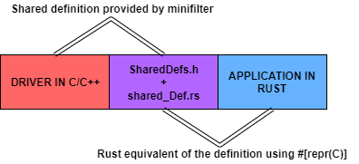
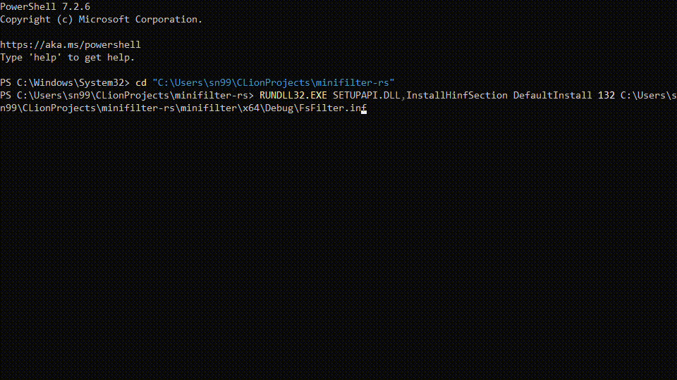

# fsfilter-rs

[](https://github.com/SubconsciousCompute/fsfilter-rs/actions/workflows/rust.yml)
[](https://crates.io/crates/fsfilter-rs)
[](https://docs.rs/fsfilter-rs/latest/fsfilter_rs/)

A rust library to monitor filesystem and more in windows.



## MINIFILTER

See [MINIFILTER.md](MINIFILTER.md) for building the minifilter or just [right click install using the `.inf` file
provided in releases](https://github.com/SubconsciousCompute/fsfilter-rs/releases/latest/download/snFilter.zip).

You can also build using [EWDK](EWDKbuild.md) if you don't want to install Visual Studio, SDK and WDK.

**NOTE: By default, it is built for Windows 10 and above.**

**NOTE: Enable Loading of Test Signed Drivers by executing `Bcdedit.exe -set TESTSIGNING ON` in administrative cmd.**

## RUNNING EXAMPLE

Use `cargo run --bin minifilter --release` to run the example application or just [run the `.exe` provided in
releases](https://github.com/SubconsciousCompute/fsfilter-rs/releases/latest/download/minifilter.exe) as administrator(
for
some reason the new default terminal (not the one that opens when you run it as administrator) on 2H22 is very, very
slow).

The program starts to print the `IOMessage` which is defined like:

```rust
#[repr(C)]
pub struct IOMessage {
    /// The file extension
    pub extension: [wchar_t; 12],
    /// Hard Disk Volume Serial Number where the file is saved (from [`FILE_ID_INFO`])
    pub file_id_vsn: c_ulonglong,
    /// File ID on the disk ([`FILE_ID_INFO`])
    pub file_id_id: [u8; 16],
    /// Number of bytes transferred (`IO_STATUS_BLOCK.Information`)
    pub mem_sized_used: c_ulonglong,
    /// (Optional) File Entropy calculated by the driver
    pub entropy: f64,
    /// Pid responsible for this io activity
    pub pid: c_ulong,
    /// Windows IRP Type caught by the minifilter:
    /// - NONE (0)
    /// - READ (1)
    /// - WRITE (2)
    /// - SETINFO (3)
    /// - CREATE (4)
    /// - CLEANUP (5)
    pub irp_op: c_uchar,
    /// Is the entropy calculated?
    pub is_entropy_calc: u8,
    /// Type of i/o operation:
    /// - FILE_CHANGE_NOT_SET (0)
    /// - FILE_OPEN_DIRECTORY (1)
    /// - FILE_CHANGE_WRITE (2)
    /// - FILE_CHANGE_NEW_FILE (3)
    /// - FILE_CHANGE_RENAME_FILE (4)
    /// - FILE_CHANGE_EXTENSION_CHANGED (5)
    /// - FILE_CHANGE_DELETE_FILE (6)
    /// - FILE_CHANGE_DELETE_NEW_FILE (7)
    /// - FILE_CHANGE_OVERWRITE_FILE (8)
    pub file_change: c_uchar,
    /// The driver has the ability to monitor specific directories only (feature currently not used):
    /// - FILE_NOT_PROTECTED (0): Monitored dirs do not contained this file
    /// - FILE_PROTECTED (1)
    /// - FILE_MOVED_IN (2)
    /// - FILE_MOVED_OUT (3)
    pub file_location_info: c_uchar,
    /// File path on the disk
    pub filepathstr: String,
    /// Group Identifier (maintained by the minifilter) of the operation
    pub gid: c_ulonglong,
    /// see class [`RuntimeFeatures`]
    pub runtime_features: RuntimeFeatures,
    /// Size of the file. Can be equal to -1 if the file path is not found.
    pub file_size: i64,
    /// Rough time at which the IRP was created
    pub time: SystemTime,
}
```

We end the process using `ctrl + c` in the example video:


## PERFORMANCE

The performance of the minifilter doesn't really exceed `<1%` of the CPU usage (I never saw it tickle even to 1% while
running scripts to make multiple temporary files). Although depending on you console if you try running
`cargo run --bin minifilter --release` you might see spikes reaching `1-3%` but that is because of the console itself(
comment out the `writeln!` in the bin example) or try changing consoles (maybe run `minifilter.exe` directly).

## DEBUGGING

See [DEBUG](DEBUG.md) for setting up VMware windows machine debugging
with [VirtualKD-Redux](https://github.com/4d61726b/VirtualKD-Redux)
and [WinDbg](https://learn.microsoft.com/en-us/windows-hardware/drivers/debugger/debugging-using-windbg-preview).

## MAINTAINERS

Feel free to open issues to ask any questions/queries. You're free to ping the current maintainers.

Currently maintained by the following:

- [sn99](https://github.com/sn99) (original author)

Previous maintainers:

- N/A

## LICENSE

This project is licensed under the terms of the [MIT license](LICENSE.md).

## ACKNOWLEDGEMENTS

- [RansomWatch](https://github.com/RafWu/RansomWatch)
- [SitinCloud](https://github.com/SitinCloud)
- [SubconsciousCompute](https://github.com/SubconsciousCompute)
